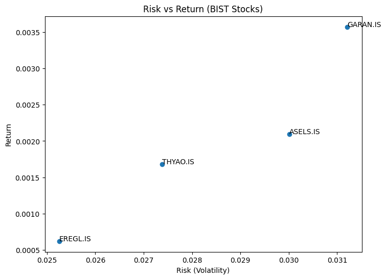
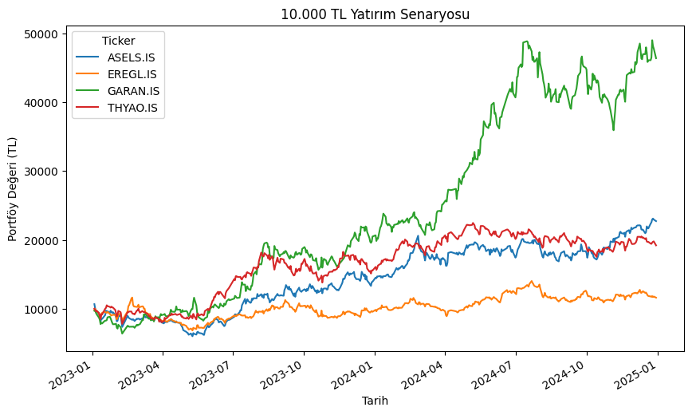
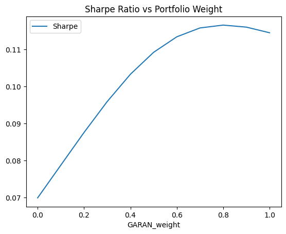

# 📊 BIST Stock Analysis Project

## Objective
Analyze BIST stocks (2023–2024) to evaluate risk-return trade-offs and optimize a portfolio.

## Tools
Python, Pandas, Matplotlib, yfinance

## Key Result
Optimal portfolio:
- 80% GARAN
- 20% ASELS

- ## Visuals

### Risk vs Return

### Investment Simulation

### Sharpe Optimization

